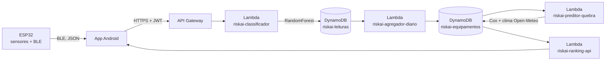

# Documento de Evolução Técnica — RiskAI (Sompo Seguros)
## Challenge Sprint 3 — FIAP

---

## 1. Resumo da Sprint

### O que foi desenvolvido na Sprint 3
- Firmware ESP32 com leitura de sensores (DHT22, MPU6050, dois VL53L1X ToF) e envio via BLE para o app Android
- App Android nativo (Kotlin/Jetpack Compose) com: cadastro de equipamento, dashboard visual (cards de resumo, gráfico de pizza por nível de risco, gráfico de barras top 10, lista de equipamentos), integração completa com a AWS
- Arquitetura AWS ponta a ponta: API Gateway com autenticação JWT (Cognito) → Lambda de classificação de risco (RandomForest) → DynamoDB → Lambda de agregação diária → Lambda de previsão de quebra (Cox Proportional Hazards, com dados de clima via Open-Meteo) → API de ranking consumida pelo dashboard
- Pipeline de dados de teste (seed) validado ponta a ponta, permitindo demonstrar o fluxo completo mesmo com hardware físico ainda parcial

### Principais evoluções em relação à Sprint 2
- Migração do mobile de PWA para app Android nativo, viabilizando BLE em background
- Implementação da camada de agregação diária de risco, que ainda não existia
- Integração real da Camada 2 de Machine Learning (sobrevivência/Cox) com dados climáticos externos
- Dashboard visual completo substituindo protótipo com dados mockados

### Percentual aproximado de conclusão
**~80%** do escopo priorizado para este projeto.

### Principais dificuldades encontradas
- Sensores físicos (MPU6050, sensores de distância) com entrega atrasada, exigindo mock de valores no firmware para não travar o desenvolvimento do restante do pipeline
- Ambiente AWS Academy Learner Lab com restrições de permissão (sem criação de IAM roles), exigindo adaptação da arquitetura (ex.: Lambda orquestradora usando `lambda:InvokeFunction` em vez de credenciais diretas no app)
- Incompatibilidade de payload entre app e Lambda de classificação, identificada e corrigida durante testes de integração

---

## 2. Feedback da Sompo

### Principais comentários recebidos
- **Pontos positivos**: a equipe já possui um modelo de Machine Learning desenvolvido e está avaliando criticamente se a inclusão de novas variáveis realmente agregaria valor. A Sompo sinalizou que as variáveis atualmente utilizadas podem ser suficientes, evitando a necessidade de buscar dados adicionais sem justificativa clara.
- **Pontos de atenção**: a apresentação anterior teve excesso de foco em código, reduzindo o espaço dedicado à demonstração do produto e da solução funcionando.

### Alterações realizadas a partir do feedback
- Priorização da demonstração do produto (dashboard, fluxo funcionando ponta a ponta) em vez de detalhes de implementação no próximo pitch
- Decisão de não buscar novas variáveis externas sem antes avaliar se as atuais já atendem ao objetivo do modelo

### Sugestões que não serão implementadas (por ora), com justificativa
- Busca de novas variáveis de dados externas: adiada até haver avaliação clara de necessidade e impacto real no modelo, conforme orientação da própria Sompo, para evitar complexidade desnecessária

---

## 3. User Stories Trabalhadas

| US | O que foi implementado | Status | Evidência |
|---|---|---|---|
| Score de risco por equipamento e tipo de operação (visão Sompo) | Classificação por leitura via RandomForest + previsão de quebra/perda esperada via Cox Proportional Hazards, rodando ponta a ponta na AWS | ✅ Concluído | Dashboard exibindo score e perda esperada por equipamento |
| Painel de risco por equipamento (visão Cliente) | Dashboard Android com cards de resumo, gráfico de pizza por nível de risco, gráfico de barras (top 10) | ✅ Concluído | Prints/vídeo do dashboard |
| Ranking de risco por equipamento (visão Gestor de Frota) | Endpoint `GET /ranking` + tela de ranking no app, ordenado por probabilidade de quebra | ✅ Concluído | Prints/vídeo da tela de ranking |
| Integração com fontes diversas — clima (visão Sompo) | Dados climáticos históricos via Open-Meteo integrados ao modelo de sobrevivência (Camada 2) | 🟡 Parcial | Logs/código da Lambda `riskai-preditor-quebra` |
| Trilha de auditoria — dados usados, versão do modelo (visão Sompo) | DynamoDB registra leituras, timestamps e probabilidades de cada classificação | 🟡 Parcial | Schema da tabela `riskai-leituras` |
| Relatórios por fazenda/região/período (visão Cliente) | Geração de relatório em PDF e dashboard de tendências — planejado | 🔴 Pendente | — |

---

## 4. Visão Técnica da Solução

### Tecnologias utilizadas
- **Hardware/Firmware**: ESP32, C++ (PlatformIO), sensores DHT22, MPU6050, VL53L1X
- **Mobile**: Kotlin, Jetpack Compose, BLE nativo Android, AWS Amplify (autenticação)
- **Backend**: AWS Lambda (Python), API Gateway (HTTP API, autenticação JWT via Cognito), DynamoDB
- **Machine Learning**: scikit-learn (RandomForestClassifier), lifelines (Cox Proportional Hazards), Open-Meteo API (dados climáticos)

### Organização geral do projeto
Monorepo com quatro grandes áreas: app Android, firmware ESP32, Lambdas AWS (uma pasta por função) e documentação — ver `README.md` na raiz do repositório para a estrutura completa.

### Principais componentes e integração

---

## 5. Evidências de Funcionamento

_(seção a completar com prints, vídeo e resultados reais antes da entrega final — telas do app, chamadas de API com sucesso, exemplo de classificação, dashboard atualizado)_

---

## 6. Pendências e Próximos Passos

### O que ainda precisa ser desenvolvido
- Alertas preventivos em tempo de decisão (hoje o sistema é consultivo, não emite alerta ativo)
- Explicabilidade dos resultados (quais fatores mais pesaram no score de risco)
- Relatórios por fazenda/região/período com tendência e incidentes evitados (PDF/dashboard)
- Detecção de proximidade de água / zonas críticas específicas
- Integração do mapa com marcador arrastável no cadastro de equipamento (Google Maps SDK)

### Principais limitações atuais
- Sensores físicos (MPU6050, distância) ainda não instalados fisicamente — valores mockados no firmware
- Modelos de sobrevivência (Cox) treinados com dados sintéticos, por falta de volume real de quebras — não valem para decisão real ainda
)

### Prioridades para a próxima sprint
- Priorizar demonstração do produto funcionando (conforme feedback da Sompo) em vez de aprofundar em código durante apresentações
